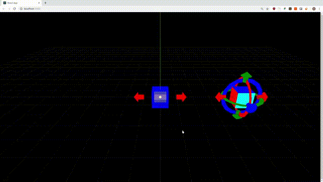

# ThreeJS Freeform Controls

[](https://travis-ci.org/tocttou/three-freeform-controls)
[](https://greenkeeper.io/)



Todo list:

- [ ] Documentation
- [ ] Examples
- [ ] Tests
- [ ] Mode: Rotation around arbitrary axes
- [ ] Mode: Inherit orientation from object
- [ ] Eye plane rotation controls
- [x] Translation controls
- [x] Rotation controls
- [x] Free pick controls
- [x] Pick via places controls
- [x] Enable/disable controls
- [x] Multiple controls instances at once
- [x] Typescript

### Documentation

Work in progress. Will be updated soon.

```typescript
import FreeformControls, { RAYCASTER_EVENTS } from "three-freeform-controls";

// instantiation
const freeFormControls = new FreeformControls(camera, renderer.domElement);
scene.add(freeFormControls);

// attach (to Object3D)
freeFormControls.attach(object);

// hide specific controls
freeFormControls.showZT(false);
freeFormControls.showZR(false);
freeFormControls.pickPlaneZX(false);
freeFormControls.showPickT(false);

// detach
freeFormControls.detach(object);

// events
freeFormControls.listen(RAYCASTER_EVENTS.DRAG_START, (object: Object3D, handleName: string) => {
  orbitControls.enabled = false;
});

freeFormControls.listen(RAYCASTER_EVENTS.DRAG, (object: Object3D, handleName: string) => {
  console.log(object, "dragged by", handleName);
});

freeFormControls.listen(RAYCASTER_EVENTS.DRAG_STOP, (object: Object3D, handleName: string) => {
  orbitControls.enabled = true;
});

// destroy
freeFormControls.destroy();
```
